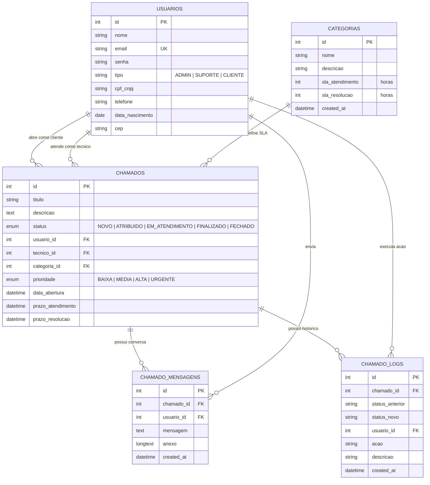
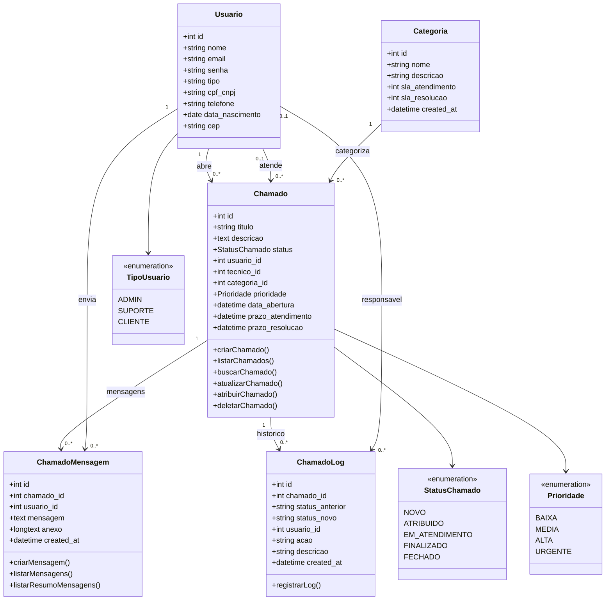

# Modelagem DER e Diagrama de Classes - HelpDesk

Este arquivo foi gerado com base no projeto atual. Para usar no draw.io/diagrams.net, copie o bloco Mermaid desejado e importe em:

`Inserir > Avancado > Mermaid`

## DER - Diagrama Entidade-Relacionamento

## Diagrama de Classes

## Regras de Negocio Representadas

- Um usuario pode ser `ADMIN`, `SUPORTE` ou `CLIENTE`.
- O cliente abre chamados e visualiza somente os proprios chamados.
- O tecnico de suporte atende chamados atribuidos a ele.
- O administrador pode gerenciar chamados, usuarios, categorias e reabrir chamados encerrados.
- Cada chamado pertence a uma categoria, e a categoria define os SLAs de atendimento e resolucao.
- Ao criar um chamado, o sistema calcula `prazo_atendimento` e `prazo_resolucao` com base no SLA da categoria.
- O ciclo de status do chamado e: `NOVO`, `ATRIBUIDO`, `EM_ATENDIMENTO`, `FINALIZADO` e `FECHADO`.
- Mensagens e anexos ficam associados ao chamado, formando a conversa do atendimento.
- Logs registram a criacao, atribuicao, alteracoes de status, validacao do cliente e exclusao.

## Cardinalidades

- `USUARIOS 1:N CHAMADOS` como cliente: um usuario pode abrir varios chamados.
- `USUARIOS 1:N CHAMADOS` como tecnico: um tecnico pode atender varios chamados; o chamado pode ficar sem tecnico no inicio.
- `CATEGORIAS 1:N CHAMADOS`: uma categoria pode classificar varios chamados.
- `CHAMADOS 1:N CHAMADO_MENSAGENS`: um chamado pode conter varias mensagens.
- `USUARIOS 1:N CHAMADO_MENSAGENS`: um usuario pode enviar varias mensagens.
- `CHAMADOS 1:N CHAMADO_LOGS`: um chamado pode ter varios registros de historico.
- `USUARIOS 0..1:N CHAMADO_LOGS`: um log pode ser associado ao usuario que executou a acao.
